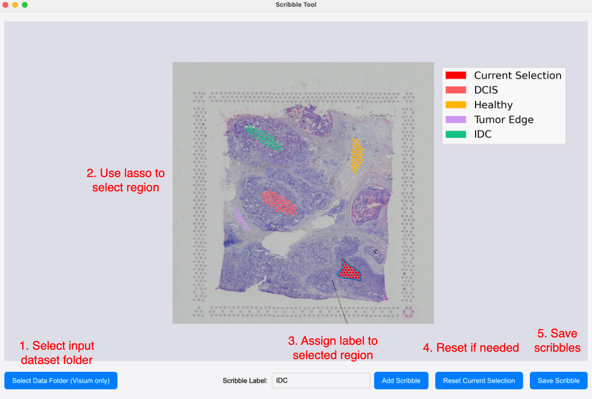
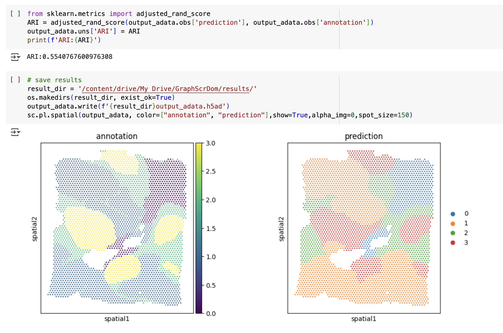

# GraphScrDom

GraphScrDom is a semi-supervised spatial domain detection tool designed for spatial transcriptomics data. It integrates spatial gene expression and cell type composition through a graph-based deep learning framework. Users can interactively annotate partial labels via histology-guided scribbles. GraphScrDom achieves accurate and biologically meaningful spatial domain identification, even with minimal supervision.

---

## 📦 Pipeline Overview

The pipeline consists of two main modules:

---

### 📌 Module 1: Scribble Annotation

Use the **GraphScrDom** tool to manually annotate scribbles on the tissue image via free-form lasso selections, providing **partial supervision** for downstream training.  

We provide both **Windows** and **macOS** compatible versions of the Scribble Tool.
- [Download for Windows](link)
- [Download for macOS](link)

#### GUI Example:

  

---

### 📌 Module 2: Domain Detection and Evaluation (Google Colab)

Use the generated annotations from **Module 1**, along with cell type compositions and optional ground-truth labels, to train and evaluate the **GraphScrDom** domain detection model in **Google Colab**.

#### 📥 Required Inputs:
- `anndata`: spatial transcriptomics data in .h5/.h5ad
- `scribble.csv`: partial labels from Scribble Tool  
- `deconvolution.csv`: cell type composition matrix (e.g., from **Cell2location**)  
- `annotation.csv` *(optional)*: ground-truth domain labels for evaluation only  

#### 💻 Colab Example:

**[Run this notebook in Google Colab](https://colab.research.google.com/drive/1HXGAxCDhzCQFMVTfWgVgLjrehmcSbb8U?usp=drive_link)**

  

